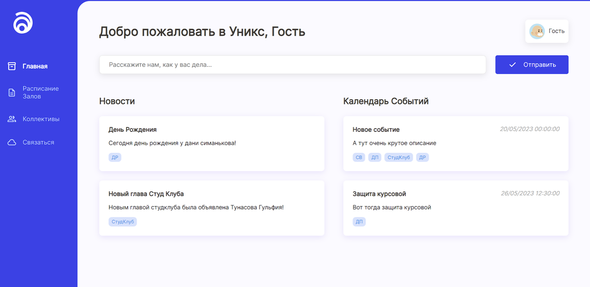
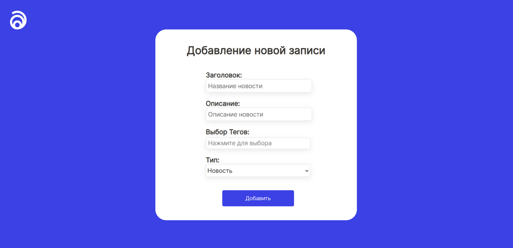

<!-- Improved compatibility of вернуться наверх link: See: https://github.com/othneildrew/Best-README-Template/pull/73 -->
<a name="readme-top"></a>
<!--
*** Thanks for checking out the Best-README-Template. If you have a suggestion
*** that would make this better, please fork the repo and create a pull request
*** or simply open an issue with the tag "enhancement".
*** Don't forget to give the project a star!
*** Thanks again! Now go create something AMAZING! :D
-->


<!-- PROJECT SHIELDS -->
<!--
*** I'm using markdown "reference style" links for readability.
*** Reference links are enclosed in brackets [ ] instead of parentheses ( ).
*** See the bottom of this document for the declaration of the reference variables
*** for contributors-url, forks-url, etc. This is an optional, concise syntax you may use.
*** https://www.markdownguide.org/basic-syntax/#reference-style-links
-->
<!-- [![Contributors][contributors-shield]][contributors-url]
[![Forks][forks-shield]][forks-url]
[![Stargazers][stars-shield]][stars-url]
[![Issues][issues-shield]][issues-url]
[![MIT License][license-shield]][license-url]
[![LinkedIn][linkedin-shield]][linkedin-url] -->


<!-- PROJECT LOGO -->
<br />
<div align="center">
  <a href="https://github.com/suisenwastaken/UniksKurs">
    
  </a>

<h3 align="center">UniksKurs</h3>

  <p align="center">
    Сайт агрегатор новостей и мероприятий КСК УНИКС
    <br />
    <a href="https://github.com/suisenwastaken/UniksKurs"><strong>Изучить»</strong></a>
    <br />
  </p>
</div>


<!-- TABLE OF CONTENTS -->
<details>
  <summary>Содержание</summary>
  <ol>
    <li>
      <a href="#о-проекте">О проекте</a>
      <ul>
        <li><a href="#использованные-технологии">Использованные технологии</a></li>
      </ul>
    </li>
    <li>
      <a href="#начало-работы">Начало работы</a>
      <ul>
        <li><a href="#предустановка">Предустановка</a></li>
        <li><a href="#установка">Установка</a></li>
      </ul>
    </li>
    <li><a href="#использование">Использование</a></li>
    <li><a href="#контакты">Контакты</a></li>
    <li><a href="#замечания">Замечания</a></li>

  </ol>
</details>

<a name="about-the-project"></a>

<!-- ABOUT THE PROJECT -->
## О проекте

<div align="center">
  
</div>


Данное веб-приложение создано с целью улучшения организации студенческих событий в рамках КСК Уникс. Это приложение предназначено для эффективной передачи информации, минимизируя неудобства текущей системы и предотвращая утерю данных из-за человеческого фактора.


<p align="right">(<a href="#readme-top">вернуться наверх</a>)</p>


### Использованные технологии

* [![dotnet][dotnet]][dotnet-url]
* [![razor][razor]][razor-url]
* [![efcore][efcore]][efcore-url]
* [![dicebear][dicebear]][dicebear-url]


<p align="right">(<a href="#readme-top">вернуться наверх</a>)</p>


<!-- GETTING STARTED -->
## Начало работы

Для начала, вам нужно выбрать вашу среду разработки, в которой вы будете запускать проект. Лично я рекомендую JB Rider - отличный инструмент для разработки приложения на asp.net.

### Предустановка

Для запуска когда вам понадобится установленный dotnet. Если вы скачали Rider, то пропускайте этот шаг, т.к. dotnet у вас установился автоматический.
Если вы решили устанавливать dotnet вручную, перейдите на сайт https://learn.microsoft.com/en-us/dotnet/core/install/windows?tabs=net80 и скачайте установщик.

### Установка

1. Клонируйте репозиторий с гитхаба 
   ```sh
   git clone https://github.com/suisenwastaken/UniksKurs
   ```
2. Запустите проект
   

<p align="right">(<a href="#readme-top">вернуться наверх</a>)</p>


<!-- USAGE EXAMPLES -->
## Использование

**Попадание на сайт**

Первым делом пользователь попадает на главную страницу, тут он видит последние новости а так же предстоящие мероприятия

<div align="center">
  
</div>
 
 Как вы видите, на сайте есть боковое меню, давайте пройдемся по нему

<br>

 **Расписание залов**

Тут находятся все расписания залов, доступные студентам для репетиций

<div align="center">
  
</div>

<br>

 **Коллективы**

На этой странице увидит список всех творческих коллективов КФУ и краткую информацию о них

<div align="center">
  
</div>
 
<br>

 **Связаться**

Тут посетитель сайта может оставить анонимное сообщение или предложение для администрации сайта

<div align="center">
  
</div>
 
_Если пользователь авторизован, то сообщение будет отправляться от его имени_

<br>

 **Регистрация**

На этой странице пользователь может зарегистрироваться в системе. Реализовано создание аватара с помощью Dice Bear API

<div align="center">
  
</div>

<br>

 **Авторизация**

На этой странице пользователь может авторизоваться в системе.

<div align="center">
  
</div>

<br>

 **Страница пользователя**

На этой странице пользователь видит информацию о своем аккаунте а так же свои коллективы

<div align="center">
  
</div>

Если же вошедший пользователь - администратор сайта, то вместо коллективов будут отображаться обращения пользователей. Так же будут доступны кнопки для добавления нового контента на сайт
 
 <div align="center">
  
</div>

<br>

 **Добавление записей**

На этой странице администратор сайта может добавлять новости или мероприятия на главную страницу сайта

<div align="center">
  
</div>

<p align="right">(<a href="#readme-top">вернуться наверх</a>)</p>


<a name="#contacts"></a>
<!--
<!-- CONTACT -->
## Контакты
 
Руслан - [@telegram](https://t.me/suisenwastaken) - suisenwastaken@gmail.com

Project Link: [https://github.com/suisenwastaken/UniksKurs](https://github.com/suisenwastaken/UniksKurs)

<p align="right">(<a href="#readme-top">вернуться наверх</a>)</p>


<!-- ACKNOWLEDGMENTS -->
## Замечания

* Данный репозиторий содержит полное приложение

<p align="right">(<a href="#readme-top">вернуться наверх</a>)</p>


<!-- MARKDOWN LINKS & IMAGES -->
<!-- https://www.markdownguide.org/basic-syntax/#reference-style-links -->
[contributors-shield]: https://img.shields.io/github/contributors/github_username/repo_name.svg?style=for-the-badge
[contributors-url]: https://github.com/github_username/repo_name/graphs/contributors
[forks-shield]: https://img.shields.io/github/forks/github_username/repo_name.svg?style=for-the-badge
[forks-url]: https://github.com/github_username/repo_name/network/members
[stars-shield]: https://img.shields.io/github/stars/github_username/repo_name.svg?style=for-the-badge
[stars-url]: https://github.com/github_username/repo_name/stargazers
[issues-shield]: https://img.shields.io/github/issues/github_username/repo_name.svg?style=for-the-badge
[issues-url]: https://github.com/github_username/repo_name/issues
[license-shield]: https://img.shields.io/github/license/github_username/repo_name.svg?style=for-the-badge
[license-url]: https://github.com/github_username/repo_name/blob/master/LICENSE.txt
[linkedin-shield]: https://img.shields.io/badge/-LinkedIn-black.svg?style=for-the-badge&logo=linkedin&colorB=555
[linkedin-url]: https://linkedin.com/in/linkedin_username


[dotnet]: https://img.shields.io/badge/.NET-512BD4?style=for-the-badge&logo=dotnet&logoColor=white
[dotnet-url]: https://dotnet.microsoft.com/en-us/
[razor]: https://img.shields.io/badge/Razor_Pages-512BD4?style=for-the-badge&logo=razor&logoColor=white
[razor-url]: https://learn.microsoft.com/en-us/aspnet/core/razor-pages/?view=aspnetcore-8.0&tabs=visual-studio
[efcore]: https://img.shields.io/badge/EFCore-512BD4?style=for-the-badge&logo=entity%20framework&logoColor=white
[efcore-url]: https://learn.microsoft.com/ru-ru/ef/
[dicebear]: https://img.shields.io/badge/Dice_Bear-0284c7?style=for-the-badge&logo=entity%20framework&logoColor=white
[dicebear-url]: https://www.dicebear.com/

[React.js]: https://img.shields.io/badge/React-20232A?style=for-the-badge&logo=react&logoColor=61DAFB
[React-url]: https://reactjs.org/
[Axios]: https://img.shields.io/badge/axios-671ddf?&style=for-the-badge&logo=axios&logoColor=white
[Axios-url]: https://axios-http.com/docs/intro
[npm]: https://img.shields.io/badge/npm-CB3837?style=for-the-badge&logo=npm&logoColor=white
[npm-url]: https://docs.npmjs.com/
[router]: https://img.shields.io/badge/React_Router-CA4245?style=for-the-badge&logo=react-router&logoColor=white
[router-url]: https://reactrouter.com/en/main
[vite]: https://img.shields.io/badge/Vite-B73BFE?style=for-the-badge&logo=vite&logoColor=FFD62E
[vite-url]: https://vitejs.dev/


